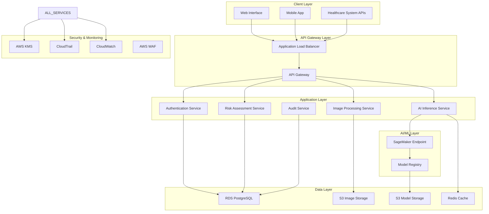

# Design Document: AI-Powered Endoscope Scar Analysis System

## Overview

The AI-powered endoscope scar analysis system is a cloud-native, HIPAA-compliant medical diagnostic platform that leverages deep learning to classify endoscope images into nine categories: normal scars and eight types of skin cancer lesions. The system is built on AWS infrastructure using a microservices architecture, providing real-time inference capabilities with medical-grade accuracy requirements.

The system integrates advanced computer vision models with healthcare workflows, offering risk stratification, clinical recommendations, and comprehensive audit logging. Key design principles include security-first architecture, scalable deployment, and seamless integration with existing healthcare systems through RESTful APIs.

## Architecture

### High-Level Architecture

The system follows a microservices architecture deployed on AWS, with clear separation of concerns between data processing, AI inference, risk assessment, and user interfaces. The architecture ensures HIPAA compliance through encryption, access controls, and comprehensive audit logging.



### Security Architecture

HIPAA compliance is achieved through multiple layers of security controls:

- **Encryption**: All data encrypted in transit (TLS 1.3) and at rest (AES-256)
- **Access Control**: Role-based access control (RBAC) with AWS IAM and custom authorization
- **Network Security**: VPC with private subnets, security groups, and AWS WAF
- **Audit Logging**: Comprehensive logging via CloudTrail and custom audit service
- **Data Isolation**: Tenant isolation and data segregation for multi-organization support

## Components and Interfaces

### Image Processing Service

**Responsibilities:**
- Validate and preprocess endoscope images
- Perform image quality assessment
- Handle image format conversions and standardization
- Manage secure image storage and retrieval

**Key Interfaces:**
```python
class ImageProcessor:
    def validate_image(self, image_data: bytes) -> ValidationResult
    def preprocess_image(self, image_data: bytes) -> ProcessedImage
    def store_image(self, image: ProcessedImage, metadata: ImageMetadata) -> str
    def retrieve_image(self, image_id: str) -> ProcessedImage
```

**Technical Implementation:**
- Built using Python with OpenCV and PIL for image processing
- Deployed as containerized service on AWS ECS
- Integrates with S3 for secure image storage with server-side encryption
- Implements image quality metrics including resolution, contrast, and artifact detection

### AI Inference Service

**Responsibilities:**
- Execute deep learning model inference on preprocessed images
- Manage model versioning and A/B testing
- Provide confidence scores and uncertainty quantification
- Handle batch and real-time inference requests

**Key Interfaces:**
```python
class AIInferenceService:
    def classify_image(self, image: ProcessedImage) -> ClassificationResult
    def get_model_info(self) -> ModelMetadata
    def health_check(self) -> ServiceHealth
```

**Technical Implementation:**
- Utilizes AWS SageMaker real-time endpoints for inference
- Implements ensemble of CNN models (EfficientNet-B7, ResNet-152, DenseNet-201)
- Supports model versioning and blue-green deployments
- Includes uncertainty quantification using Monte Carlo dropout
- Auto-scaling based on request volume with sub-2-second response time guarantee

### Risk Assessment Service

**Responsibilities:**
- Analyze classification results and assign risk levels
- Generate clinical recommendations based on classification and patient context
- Implement clinical decision support algorithms
- Provide explainable AI insights for healthcare providers

**Key Interfaces:**
```python
class RiskAssessmentService:
    def assess_risk(self, classification: ClassificationResult, context: PatientContext) -> RiskAssessment
    def generate_recommendations(self, risk_assessment: RiskAssessment) -> ClinicalRecommendations
    def explain_decision(self, assessment: RiskAssessment) -> ExplanationReport
```

**Technical Implementation:**
- Rule-based system combined with machine learning for risk stratification
- Integrates clinical guidelines and best practices
- Provides gradient-based and attention-based explanations for AI decisions
- Supports customizable risk thresholds per healthcare organization

### Authentication and Authorization Service

**Responsibilities:**
- Manage user authentication and session management
- Implement role-based access control (RBAC)
- Handle healthcare provider credentialing
- Ensure HIPAA-compliant access logging

**Key Interfaces:**
```python
class AuthService:
    def authenticate_user(self, credentials: UserCredentials) -> AuthToken
    def authorize_action(self, token: AuthToken, resource: str, action: str) -> bool
    def get_user_permissions(self, user_id: str) -> List[Permission]
    def audit_access(self, user_id: str, resource: str, action: str) -> None
```

**Technical Implementation:**
- JWT-based authentication with refresh token rotation
- Integration with healthcare organization identity providers (SAML, OIDC)
- Multi-factor authentication support
- Session management with configurable timeout policies

### Audit and Compliance Service

**Responsibilities:**
- Log all system activities for HIPAA compliance
- Generate audit reports and compliance dashboards
- Monitor for suspicious activities and security events
- Manage data retention and purging policies

**Key Interfaces:**
```python
class AuditService:
    def log_event(self, event: AuditEvent) -> None
    def generate_audit_report(self, criteria: ReportCriteria) -> AuditReport
    def monitor_compliance(self) -> ComplianceStatus
    def purge_expired_data(self) -> PurgeResult
```

**Technical Implementation:**
- Structured logging with correlation IDs for request tracing
- Integration with AWS CloudTrail and CloudWatch
- Real-time alerting for compliance violations
- Automated data lifecycle management

## Data Models

### Core Domain Models

```python
@dataclass
class ImageMetadata:
    image_id: str
    patient_id: str
    provider_id: str
    timestamp: datetime
    image_format: str
    resolution: Tuple[int, int]
    file_size: int
    checksum: str
    acquisition_device: str

@dataclass
class ClassificationResult:
    image_id: str
    predicted_class: SkinLesionType
    confidence_scores: Dict[SkinLesionType, float]
    uncertainty_measure: float
    model_version: str
    inference_time: float
    timestamp: datetime

@dataclass
class RiskAssessment:
    assessment_id: str
    image_id: str
    risk_level: RiskLevel  # LOW, MODERATE, HIGH, CRITICAL
    cancer_probability: float
    urgency_score: int
    clinical_features: List[ClinicalFeature]
    timestamp: datetime

@dataclass
class ClinicalRecommendations:
    assessment_id: str
    primary_recommendation: str
    follow_up_actions: List[str]
    specialist_referral: Optional[SpecialistReferral]
    monitoring_schedule: Optional[MonitoringSchedule]
    patient_education: List[str]
```

### Enumeration Types

```python
class SkinLesionType(Enum):
    NORMAL_SCAR = "normal_scar"
    MELANOMA = "melanoma"
    BASAL_CELL_CARCINOMA = "basal_cell_carcinoma"
    SQUAMOUS_CELL_CARCINOMA = "squamous_cell_carcinoma"
    ACTINIC_KERATOSIS = "actinic_keratosis"
    SEBORRHEIC_KERATOSIS = "seborrheic_keratosis"
    NEVUS = "nevus"
    DERMATOFIBROMA = "dermatofibroma"
    VASCULAR_LESION = "vascular_lesion"

class RiskLevel(Enum):
    LOW = "low"
    MODERATE = "moderate"
    HIGH = "high"
    CRITICAL = "critical"
```

### Database Schema

The system uses PostgreSQL for structured data storage with the following key tables:

```sql
-- Users and authentication
CREATE TABLE users (
    user_id UUID PRIMARY KEY,
    email VARCHAR(255) UNIQUE NOT NULL,
    role VARCHAR(50) NOT NULL,
    organization_id UUID NOT NULL,
    created_at TIMESTAMP DEFAULT NOW(),
    last_login TIMESTAMP,
    is_active BOOLEAN DEFAULT TRUE
);

-- Image metadata and analysis results
CREATE TABLE image_analyses (
    analysis_id UUID PRIMARY KEY,
    image_id UUID NOT NULL,
    patient_id UUID NOT NULL,
    provider_id UUID NOT NULL,
    predicted_class VARCHAR(50) NOT NULL,
    confidence_scores JSONB NOT NULL,
    risk_level VARCHAR(20) NOT NULL,
    recommendations JSONB NOT NULL,
    model_version VARCHAR(50) NOT NULL,
    created_at TIMESTAMP DEFAULT NOW(),
    updated_at TIMESTAMP DEFAULT NOW()
);

-- Audit logs for compliance
CREATE TABLE audit_logs (
    log_id UUID PRIMARY KEY,
    user_id UUID,
    action VARCHAR(100) NOT NULL,
    resource_type VARCHAR(50) NOT NULL,
    resource_id UUID,
    ip_address INET,
    user_agent TEXT,
    timestamp TIMESTAMP DEFAULT NOW(),
    details JSONB
);
```

## Correctness Properties

*A property is a characteristic or behavior that should hold true across all valid executions of a system—essentially, a formal statement about what the system should do. Properties serve as the bridge between human-readable specifications and machine-verifiable correctness guarantees.*

### Property 1: Classification Output Completeness
*For any* valid endoscope image input, the classifier should return a result containing exactly one predicted class from the 9 valid skin lesion types and confidence scores for all 9 classes
**Validates: Requirements 1.1, 1.5**

### Property 2: Risk Assessment Completeness  
*For any* classification result, the risk stratifier should return an assessment containing one of the four valid risk levels (Low, Moderate, High, Critical), clinical recommendations, and uncertainty measures
**Validates: Requirements 3.1, 3.2, 3.5**

### Property 3: Cancer Detection Clinical Rules
*For any* classification result indicating cancer (Melanoma, BCC, SCC, Actinic Keratosis), the clinical recommendations should include immediate specialist referral
**Validates: Requirements 3.3**

### Property 4: Normal Scar Clinical Rules
*For any* classification result indicating normal scar, the clinical recommendations should include routine monitoring guidance
**Validates: Requirements 3.4**

### Property 5: Image Validation Consistency
*For any* input data, the image processor should accept only data that meets endoscope image specifications (format, resolution, quality) and reject all invalid inputs with descriptive error messages
**Validates: Requirements 1.4, 8.1**

### Property 6: Access Control Enforcement
*For any* user request, the system should grant access only to users with valid authentication and appropriate role-based permissions for the requested resource
**Validates: Requirements 4.3**

### Property 7: Comprehensive Audit Logging
*For any* system action involving patient data access, modification, or analysis, an audit log entry should be created containing timestamp, user ID, action type, and resource details
**Validates: Requirements 4.4, 7.1**

### Property 8: API Error Handling Consistency
*For any* API request that results in an error condition, the system should return a standardized error response with appropriate HTTP status code and descriptive error message
**Validates: Requirements 5.5**

### Property 9: Healthcare Data Format Support
*For any* valid DICOM or HL7 FHIR formatted request, the system should properly parse and process the data according to the respective standard specifications
**Validates: Requirements 5.2**

### Property 10: Data Export Integrity
*For any* data export request, the exported data should maintain original metadata integrity and conform to standard medical imaging formats
**Validates: Requirements 8.5**

### Property 11: Session State Persistence
*For any* authenticated user session, previously analyzed images should remain accessible for viewing even when the user reconnects after session timeout
**Validates: Requirements 6.5**

### Property 12: System Monitoring Completeness
*For any* system operation, performance metrics (response time, resource utilization) should be recorded and anomalies should trigger appropriate administrative alerts
**Validates: Requirements 7.2, 7.3**

### Property 13: Data Retention Policy Enforcement
*For any* patient data older than the configured retention period, the system should automatically purge the data while maintaining audit trail of the purge operation
**Validates: Requirements 4.5**

### Property 14: Batch Processing Consistency
*For any* batch of images uploaded simultaneously, each image should be processed independently and results should be returned in a consistent format regardless of batch size
**Validates: Requirements 6.3**

### Property 15: Model Version Compatibility
*For any* model update deployment, existing API contracts should remain functional and model version information should be included in all classification results
**Validates: Requirements 8.3**

## Error Handling

The system implements comprehensive error handling across all components to ensure graceful degradation and proper error reporting:

### Image Processing Errors
- **Invalid Image Format**: Return HTTP 400 with specific format requirements
- **Image Quality Issues**: Return HTTP 422 with quality assessment details
- **File Size Violations**: Return HTTP 413 with size limit information
- **Corrupted Image Data**: Return HTTP 400 with corruption detection details

### AI Inference Errors
- **Model Unavailable**: Return HTTP 503 with retry-after header
- **Inference Timeout**: Return HTTP 504 with timeout information
- **Model Version Mismatch**: Return HTTP 409 with version compatibility details
- **Insufficient Confidence**: Return HTTP 200 with uncertainty flags in response

### Authentication and Authorization Errors
- **Invalid Credentials**: Return HTTP 401 with authentication requirements
- **Insufficient Permissions**: Return HTTP 403 with required role information
- **Session Expired**: Return HTTP 401 with refresh token guidance
- **Rate Limit Exceeded**: Return HTTP 429 with retry-after header

### Data Access Errors
- **Resource Not Found**: Return HTTP 404 with resource identifier
- **Data Corruption Detected**: Return HTTP 500 with integrity check details
- **Database Connection Issues**: Return HTTP 503 with service status
- **Audit Log Failures**: Return HTTP 500 with compliance alert

### Integration Errors
- **Webhook Delivery Failures**: Implement exponential backoff retry with dead letter queue
- **DICOM/FHIR Parsing Errors**: Return HTTP 400 with specific parsing error details
- **External System Timeouts**: Return HTTP 504 with upstream service information
- **API Rate Limiting**: Return HTTP 429 with quota and reset time information

## Testing Strategy

The system employs a comprehensive dual testing approach combining unit tests for specific scenarios and property-based tests for universal correctness validation.

### Property-Based Testing

Property-based tests validate universal properties across randomly generated inputs using Hypothesis (Python) with minimum 100 iterations per test. Each property test references its corresponding design document property:

- **Classification Properties**: Generate random valid endoscope images and verify output format consistency
- **Risk Assessment Properties**: Generate random classification results and verify risk stratification completeness
- **Clinical Rule Properties**: Generate cancer and normal classifications and verify appropriate recommendations
- **Input Validation Properties**: Generate random image data including invalid formats and verify proper rejection
- **Access Control Properties**: Generate random user credentials and permission combinations
- **Audit Logging Properties**: Generate random system actions and verify comprehensive log creation
- **API Properties**: Generate random API requests including error conditions and verify response format
- **Data Format Properties**: Generate random DICOM/FHIR data and verify proper parsing
- **Export Properties**: Generate random data sets and verify export integrity
- **Session Properties**: Generate random session scenarios and verify state persistence

### Unit Testing

Unit tests focus on specific examples, edge cases, and integration points:

- **Model Integration Tests**: Verify SageMaker endpoint integration with known test images
- **Database Integration Tests**: Verify PostgreSQL operations with specific data scenarios
- **Authentication Tests**: Test specific credential validation and JWT token handling
- **Image Processing Tests**: Test specific image formats, resolutions, and quality scenarios
- **Clinical Decision Tests**: Test specific cancer types and risk level assignments
- **Compliance Tests**: Test specific HIPAA requirements with known audit scenarios
- **Performance Tests**: Verify response time requirements with controlled load scenarios
- **Error Recovery Tests**: Test specific failure scenarios and recovery mechanisms

### Test Configuration

- **Property Tests**: Minimum 100 iterations per test with configurable seed for reproducibility
- **Test Tagging**: Each test tagged with format: **Feature: endoscope-scar-analysis, Property {number}: {property_text}**
- **Coverage Requirements**: Minimum 90% code coverage for all business logic components
- **Performance Benchmarks**: Response time validation with 95th percentile under 2 seconds
- **Security Testing**: Automated vulnerability scanning and penetration testing
- **Compliance Testing**: Automated HIPAA compliance validation with audit trail verification

### Continuous Integration

- **Automated Testing**: All tests run on every commit with parallel execution
- **Model Validation**: Automated accuracy validation against held-out test dataset
- **Security Scanning**: Automated dependency and container vulnerability scanning
- **Performance Monitoring**: Continuous performance regression testing
- **Compliance Validation**: Automated HIPAA compliance checking in CI/CD pipeline